# BetterLoka

A client-side Fabric mod for **[Loka](https://lokamc.com)** (`play.lokamc.com`), Minecraft **1.21.11**.

BetterLoka adds an in-game menu, opened with a key you bind yourself, that pulls live data from
Loka's public API and from [EldritchBot](https://eldritchbot.com). It is entirely client-side: it
never talks to the game server and sends nothing about you anywhere.

## Modules

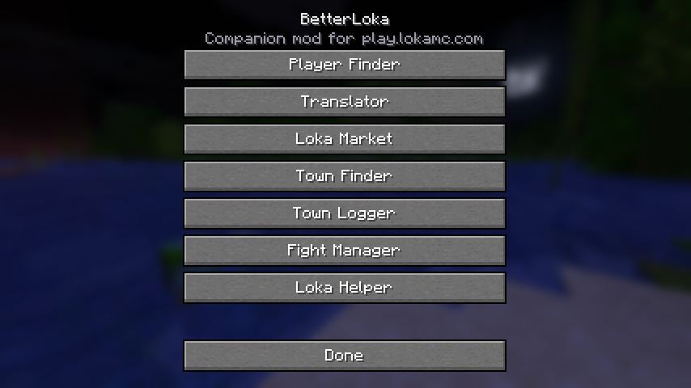

| Module | Status |
| --- | --- |
| **Player Finder** | Working |
| **Translator** | Working |
| **Loka Market** | Working |
| **Town Finder** | Working |
| **Town Logger** | Working |
| **Fight Manager** | Working |
| **Loka Grinder** | Working |
| Loka Helper | Planned |

Loka Helper is listed in the menu but opens a placeholder screen for now.

## Player Finder

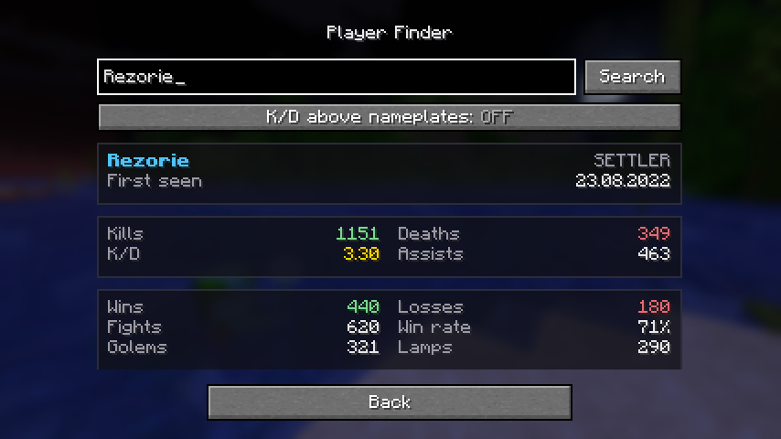

Type a Loka player's name, hit Search, and their whole Conquest record comes back in about a second:

- **Kills**, **deaths**, **assists** and **K/D**
- **Wins**, **losses**, total **fights** and **win rate**
- **Golems** and **lamps** taken
- **Potions**, **pearls**, **food** and **ancient ingots** used across their career
- Their **town** — level, continent, member count, whether it is recruiting
- **Who they currently fight for** — Loka lets players reinforce towns other than their own
- Their **nemesis**: whoever has killed them most
- **When they first appeared on Loka**, and whether they are **in a fight right now**
- Their **last 5 fights** — territory, side sizes, kills/deaths/assists, the towns, and the result

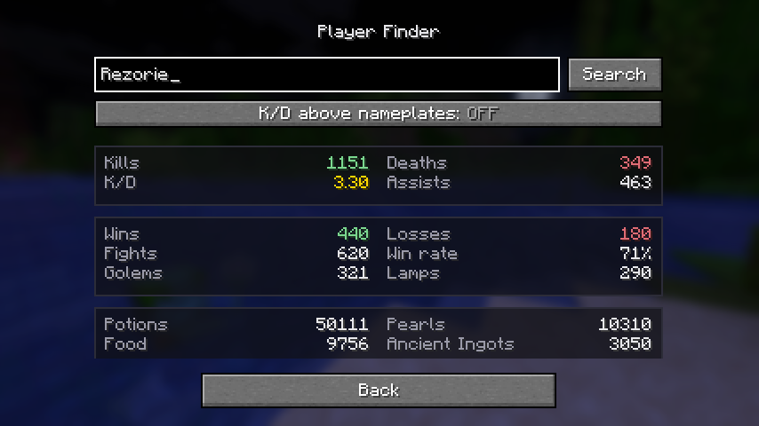

Name lookup is case-insensitive.

### Trait chips

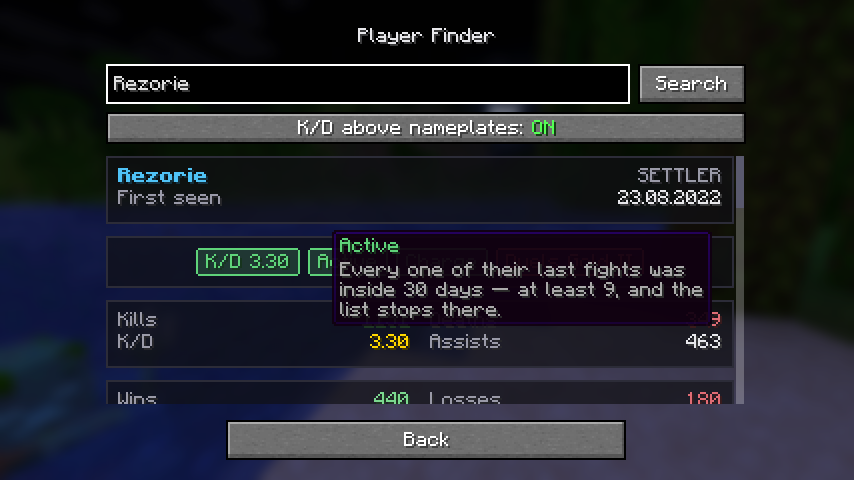

A row of coloured chips under the name, summing up how someone plays. Hover one and it says what
earned it. Green, yellow, red — and **no chip at all** when there is nothing to base one on, because
"does not duel" and "duels badly" are different claims and only one of them is an accusation.

| Chip | Green | Yellow | Red | Absent |
| --- | --- | --- | --- | --- |
| **K/D** | above 3.00 | 1.00 to 3.00 | below 1.00 | never fought |
| **Active** | every listed fight inside 30 days | 1–8 fights in 30 days | none in 30 days | — |
| **Charge** | 0.70+ charges a fight | 0.15 to 0.70 | below 0.15 | under 10 fights |
| **Duels** | above Diamond III | Emerald I to Diamond III | below Emerald I | not on either ladder |

Two of these are not quite what was asked for, because the data does not go that far:

- **Charge** was meant to be a success rate. Nothing publishes one: EldritchBot records every charge
  a player *took* — the count matches their golems and lamps exactly, in every fight checked — and no
  source anywhere records how many they went for, so there is no denominator to divide by. Charges
  per fight is the measure the data supports, and it still separates the dedicated charge-takers
  from the players who never touch it. The cuts are 0.70 and 0.15; across a sample of live careers
  the spread ran 0.00 to 2.15 with a median of 0.64, so 0.70 is about the top third.
- **Active** was meant to be "more than 10 fights in 30 days". EldritchBot lists nine recent fights
  and stops, so past nine there is nothing to count. Green therefore means *every listed fight was
  inside the window* — at least nine, and the list ran out — which the tooltip says outright.

### RIVI vs Conquest

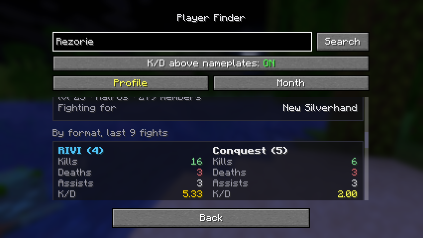

The two formats side by side — kills, deaths, assists and K/D each.

A fight is RIVI when EldritchBot names its map `the_*`: the_rivi_shores, the_jade_highlands,
the_verdant_hollows. Across every fight sampled those run about twenty players, against fifty to two
hundred and seventy on the Conquest territories, whose maps are named after the biome exactly as
Loka's own territory list has them. A live test re-checks that on every run, because if the naming
ever changes the split would quietly file fights under the wrong format.

**This is a sample, not a career.** EldritchBot publishes career totals as one lump and lists only
the nine most recent fights per player, and which map a fight was on is on that fight's own page —
so the split can only cover those nine, and the header says how many it is over.

### Month

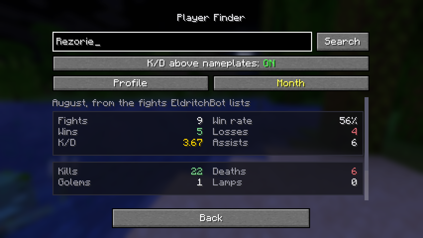

The current calendar month: fights, wins, losses, win rate, K/D, kills, deaths, assists, golems,
lamps, potions, pearls, and how many of the month's fights were RIVI. Same nine-fight ceiling, same
caveat in the header.

### Ranked 1v1

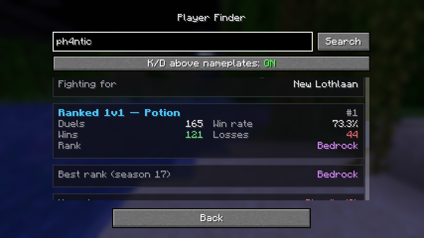

Below the Conquest record, both of Loka's ranked 1v1 ladders — Potion and Barebones — with this
season's **duels, wins, losses, win rate, rank** and ladder position, and underneath it the **best
rank they have ever held and the season they held it in**.

Loka publishes ladders rather than players, so a lookup means fetching a ladder and indexing it: the
current standings are two requests and arrive with the rest of the profile. "Best rank ever" needs
every past season's final table — about forty requests — so it is built once in the background and
the line fills in when it lands. Both are shared by every player you then look up.

A season's weekly snapshots are cumulative, which is what makes its **last published week** that
season's result and keeps this to one table per season rather than one per week. Players are followed
by UUID, not by name, because names change between seasons.

### Possible alts and old names

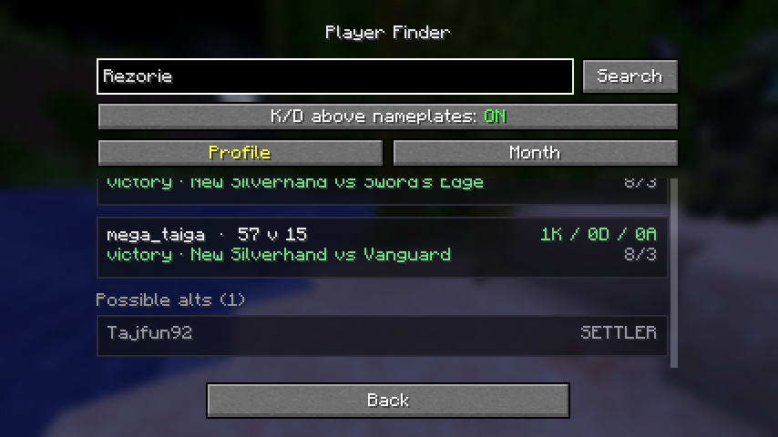

At the bottom of the profile: the other accounts this person plays on, and names they have gone by.

The alts are Loka's own grouping — accounts sharing an `identityId` are the same person, which is the
fact `/find` reports — so the mod reads it rather than sending a command as you.

Old names come from two places. **EldritchBot files a career under whatever the player was called at
their last fight**, so when Loka reports a newer name, the one on the career page is a former one —
which is the case that matters, because it is the same mismatch that used to make a renamed player
look like no player at all (below). Past seasons' ladder tables fill in the rest: they record
whatever a player was called at the time, and cost nothing since they are already cached.

Mojang stopped publishing name history in 2022 and Loka keeps only the current name, so those two are
the only sources left. Both sections are **always shown**, saying "None on record" when there is
nothing — most players have neither an alt nor a rename on file, and a panel that vanishes in that
case is indistinguishable from one that is broken.

### A player who has renamed

EldritchBot answers by name, so somebody who renamed yesterday 302s away from their new one and comes
back as "no such player" — even while they are standing on the server. Loka tracks renames, so when
the name misses, the mod looks the career up by **UUID** instead, which EldritchBot answers to
whatever they are called today. The card then shows Loka's current name, with the career's older one
listed under "Previously known as".

### K/D above nameplates

The toggle at the top of the Player Finder puts each player's K/D beside their name tag in the
world, coloured the way Loka players already read it:

| K/D | Colour |
| --- | --- |
| below 1.0 | red |
| 1.0 and above | yellow |
| 3.0 and above | gold |

Ratios are fetched in the background as players come into view, cached for fifteen minutes, and
capped at a handful of requests in flight, so a full fight fills in over a few seconds rather than
all at once.

The lookup uses the player's Mojang account name from the player list, not the text on the
nameplate: Loka decorates those with a rank ("Duelist Rezorie"), and searching a stats service for
that finds nothing.

The badge is added where the game builds the label — `EntityRenderer.getDisplayName` — rather than
by editing the render state afterwards, so it goes through vanilla's own nameplate placement,
scaling and occlusion.

## Translator

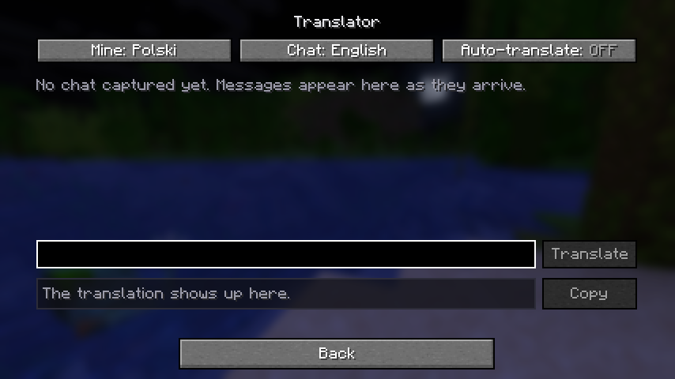

For playing on an English-speaking server without speaking English.

- **Reading**: turn *Auto-translate* on and every chat line is translated into your language as it
  arrives. The Translator shows the translation with the original underneath.
- **Writing**: type a reply in your own language, press **Translate**, and **Copy** puts the English
  version on your clipboard — paste it into chat.

Messages are listed newest first as `Name: message`. Only actual chat is kept — join notices,
territory announcements and command output are filtered out, so the conversation is not buried and
no requests are wasted translating them.

**Town and alliance chat are translated too**, and marked as such: a `[Town]` or `[Alliance]` badge
and a coloured spine down the left of the card. Loka does not label those channels in the text — it
colours them, green for town and light blue for alliance — so the mod reads the colour off the
message rather than its wording, and matches by hue so a hand-picked shade still counts. Team chat
is also parsed more loosely once identified, since it is often written `Name » message` rather than
`Name: message`.

Both languages are pickers, so this works for any pair the translation service supports, not just
Polish and English. The mod never sends anything to the server itself; you always paste it yourself.

## Loka Market

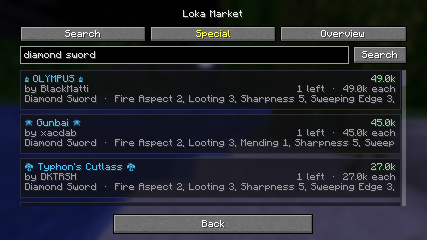

Three views over Loka's market:

- **Search** — type an item and get every offer, cheapest per unit first, with the seller, the price,
  how many they have left and the price each.
- **Special** — every *named* item on sale, dearest first. This is where the one-off swords live.
  Plain lore is not enough to qualify: on Loka every imbued item carries "Imbued in <town>" lore, so
  only a player-given name marks a piece of gear out.
- **Deals** — every listing priced well under what its item usually goes for.

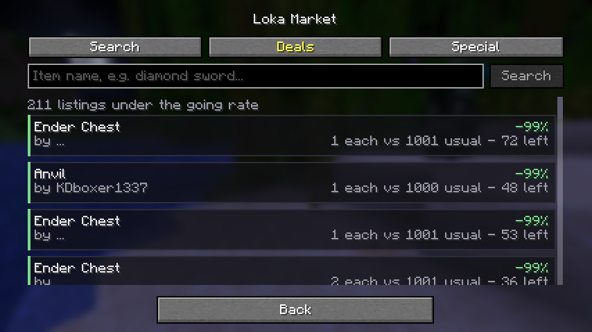

A deal is measured against the **going rate** for that item — its median price per unit — not against
the cheapest listing, since the cheapest cannot undercut itself. Anything 20% or more below the
median is listed, deepest discount first, with both prices so the number means something. Items with
fewer than three listings are skipped: two offers make each other look like a bargain or a ripoff
depending on the order.

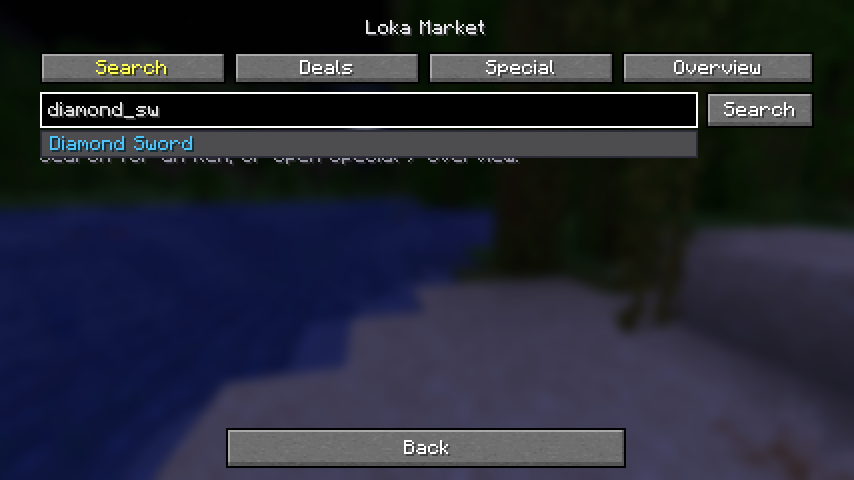

The search field suggests item types as you type — `diamond_sw` offers **Diamond Sword**; click one
to search it.

Every card is three columns: **what it is and who is selling it** on the left, **its enchantments**
down the middle, **what it costs** on the right. Enchantments are read out of the listed item stack
itself, so they show on search results as well — a bare Sharpness V book is as enchanted as a named
sword. Past five enchantments the rest are counted rather than listed, so one fully kitted sword
cannot fill the screen.

## Town Finder

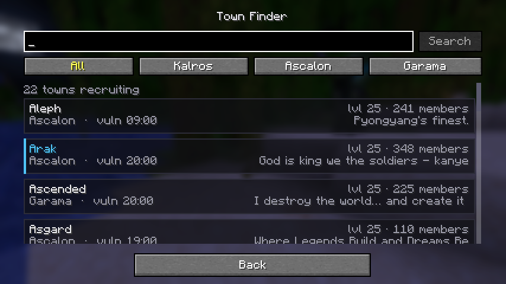

Opens on **every town currently recruiting**, filterable by continent, with level, member count,
vulnerability hour and slogan. Click any of them to open it.

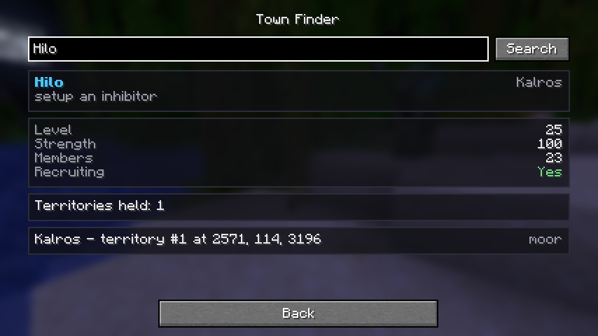

A town, whether searched for or clicked:

- **Founded** — the date and time the town was made. Loka publishes no founding date, but every
  town's ID is a MongoDB ObjectID, which begins with the second the record was created. Sixteen of
  the eighty-odd live towns carry IDs stamped inside the same five seconds in May 2021 — Loka's
  oldest towns, given new records when the database they live in was built — so those read **"On
  record since"** rather than "Founded". Presenting an import as a founding would be inventing a
  fact.
- **Active members**, and how long the town has left — see below
- **Level, strength, members, recruiting**
- **Vulnerable from** — the eight hours it is attackable for, in your own clock. Loka publishes the
  opening hour and publishes it in **UTC**: the API says 19 for a town whose in-game panel reads
  "9pm – 5am", so the number is converted rather than printed as it comes. The eight-hour length is
  the server's rule, confirmed against that panel.
- **Leader** and **sub-owners**, resolved from the identity IDs the roster stores them as, one per
  line so a town with five of them shows all five
- **Alliance** it belongs to now, and **who it has been allied with, longest first**
- Every **territory it holds**, with number and beacon coordinates

A name with no living town behind it is usually a town that is gone rather than one that never
existed, so the search falls back to the deleted-town roster and says so.

### When a town will be deleted

Loka deletes a town once it has gone **a month with no active members**. That makes the deletion date
knowable in advance, and the active count is the one number that decides it.

It is published nowhere. Every field of the town record was checked, on both the list and the
single-town endpoint, and on all 11,338 member entries across the live roster: a member entry carries
`subowner` and nothing else. The count exists only on the panel `/town info` opens.

So the mod reads it off that panel. Open `/town info <town>` yourself and the reading is recorded —
name, members, active, and when it was read. Nothing is sent: the mod never runs the command, it
looks at a screen you opened, which is the same screen you are looking at.

With a reading in hand the Town Finder shows the active count, when it was taken, and — once the
count is at zero — how many days it has been there and the date Loka could remove it.

That date is deliberately labelled **"no earlier than"**. The mod can only count from the first zero
*it* saw, and a town may have been at zero for weeks before anybody opened its panel, which would
bring the real date forward. Checking a town every few days tightens the estimate; any reading above
zero resets the clock, because the town was alive that day.

### Who they usually ally with

Loka's API publishes the alliances that exist right now and keeps **no history at all**, and nothing
else publishes one either — so this is the one thing here that cannot be answered on the spot. The
Town Logger takes a reading of every alliance on each sweep (one small request) and counts the days
each pair of towns has been allied, so the list fills in from the day the mod is first run. Until
then it says so rather than showing nothing.

## Loka Grinder

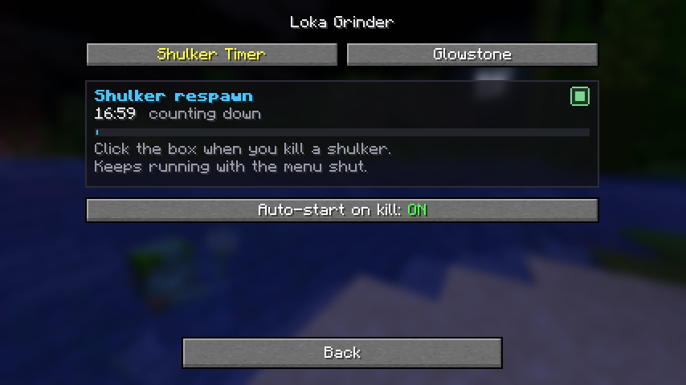

Countdowns for the things worth grinding. The timers live outside the screen, so they keep running
with the menu shut — a seventeen-minute countdown that only advanced while you watched it would be no
use at all.

- **Shulker Timer** — 17 minutes, started by the box in the corner of the card. With **auto-start**
  on it also starts by itself when a shulker you hit dies.
- **Glowstone** — 3 hours, adjustable in five-minute steps with the `-` and `+` buttons.

Both have a **keybind** (`G` and `H` by default, rebindable in Options → Controls) that starts the
timer without opening anything, which is the point of it while you are grinding. Pressing it again
restarts the countdown — the second kill of the night should not be ignored because the first timer
is still running — and pressing it on a timer that has already run out clears it.

### On-screen countdown

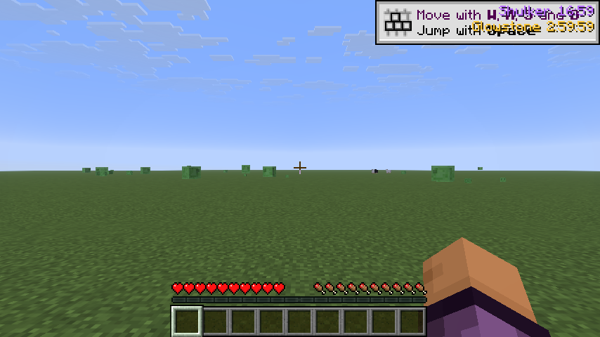

A running timer counts down in the **top right of the screen**: shulkers in purple, glowstone in
gold. It draws nothing until a timer is started, disappears when the timer is cleared, and each one
can be switched off from its own tab in the Loka Grinder screen.

Auto-start is deliberately narrow. The client is never told who landed a killing blow, so it works
from what it can see — which shulkers you swung at, and which of those then died. A shulker somebody
else finishes off after you also hit it will start the timer, and one killed with a bow will not
start it at all. The box stays the reliable way; auto-start only saves a click in the ordinary case.

## Loka Map

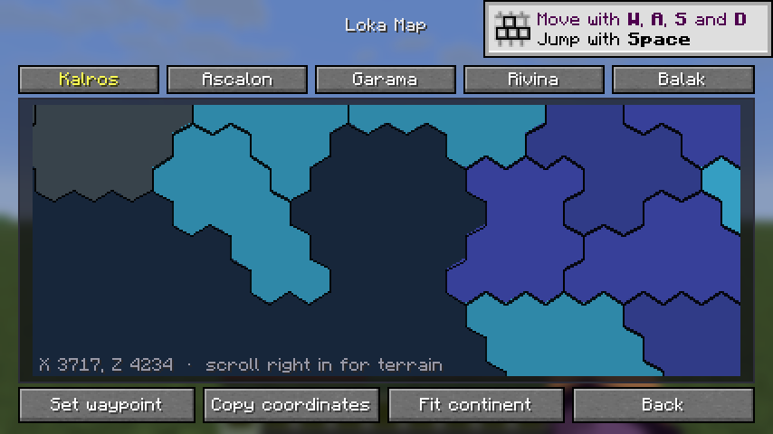

Loka's own map, drawn from Loka's own outlines, with all five continents: **Kalros, Ascalon, Garama,
Rivina and Balak**.

`map.lokamc.com` runs Dynmap and publishes each continent's territory borders as marker data — the
same file the website draws from. So the shapes here are not approximated from a beacon coordinate:
they are the real polygons, up to twenty-six sides apiece, 516 of them across the five continents.
About 440 KB in total, cached for a day, because a border moves when a territory is captured and not
otherwise.

Each territory is filled in the colour Loka gives it, outlined in the same near-black its own map
uses, and carries the same marker in the middle — the keep for a held territory, the plainer one for
neutral ground. **Hovering** one shows the card the website shows: the holding town, its alliance and
strength, its members and how many territories it holds.

The markers are Loka's artwork, so they are fetched at runtime the way a browser viewing the map
fetches them and cached under `config/betterloka/map-icons` — about ten kilobytes, once, and never
bundled into the jar.

Clicking a territory names it and offers two things:

- **Set waypoint** — drawn out in the world at the place itself, through walls and terrain, with the
  distance under it in metres or kilometres. It also lists in the corner of the screen with an arrow
  that turns as you do. Only waypoints for the continent you are standing on are drawn: a marker set
  on Kalros points nowhere useful from Garama.
- **Copy coordinates** — straight to the clipboard, in the form a command will take.

**Clear waypoints** removes them all; setting one on a territory that already has one takes that one
off.

Hit-testing is ray casting against the real outline rather than a bounding box. Loka's territories
are not rectangles, and a box would hand a corner to the neighbour.

### What is not in it yet

**The terrain itself.** Dynmap serves it as 32×32-block tiles, so a continent is tens of thousands
of them at full detail — the map here draws the territory polygons over a plain background rather
than pulling that down. The geometry, the colours, the borders and the markers are Loka's; the
scenery underneath them is not there.

## Discord bot

[`bot/`](bot/README.md) is a separate program that watches for towns falling and **pings a Discord
role** when one does, with the continent, the territory number and the beacon coordinates — so people
can get to the territory while it is still open.

It is not part of the mod on purpose: the mod runs only while somebody's game is open, and on every
player's machine, so the channel would get one ping per player per town and nothing overnight. The
bot is one process watching on everyone's behalf.

It shares the mod's data layer rather than reimplementing it — `FallenTowns`, `LokaApi` and the
models compile straight out of `src/main/java` into the bot, so the two cannot disagree about what
counts as a fallen town.

It checks **every 30 seconds** and still costs about 1.6 MB an hour, because a town falling changes
nothing in the territory list — it changes the size of Loka's deleted-town list. Asking for that
count is one 1.2 KB request; the megabyte-sized sweep behind it runs only when the count moves.
Polling the territory list directly at that rate would have been ~100 MB an hour.

On first run it records the standing backlog **quietly** rather than announcing it: there are usually
a dozen long-dead towns still holding ground, and pinging a role with all of them is how a bot gets
muted.

```bash
./gradlew :bot:botJar
java -jar bot/build/libs/betterloka-bot-<version>.jar
```

### `/sprawdz <town>`

The bot also answers a slash command: **when a town was founded, and how recently each of its members
has been seen doing anything.** It exists to guess which towns are close to being deleted.

It needs a **bot token**, not a webhook — a webhook can only speak, and a slash command has to be
listened for. With one set, the bot opens a gateway connection (about 200 lines of `java.net.http`,
no Discord library) and registers the command itself. Without one, the fallen-town watch runs exactly
as before and the log says what `/sprawdz` would need.

**"Last seen" is not a login time, and the reply says so every time.** Loka publishes no last-login
field anywhere — there is no `lastSeen` on a player record and no online-players endpoint — so the
report uses the newest of two things that only happen while somebody is actually playing: their most
recent Conquest fight, per EldritchBot, and the newest item they have listed on the market, whose
ObjectID says when it was posted. It is a **lower bound**: a player who logs in daily but neither
fights nor trades leaves no trace in anything Loka publishes, and shows as "no record".

How much of the roster it checks is `maxMembersChecked` in the config (100 by default, `0` for no
limit) — but the owner and every sub-owner are always checked on top of it, and the rest are an even
spread rather than the first N, because Loka stores members in join order and the oldest accounts are
the least active ones.

The same report runs on the console without any Discord setup at all, which is the way to see what it
answers:

```bash
java -jar bot/build/libs/betterloka-bot-<version>.jar --check "Hilo"
```

See [bot/README.md](bot/README.md) for the webhook and bot-token setup.

## Fight Manager

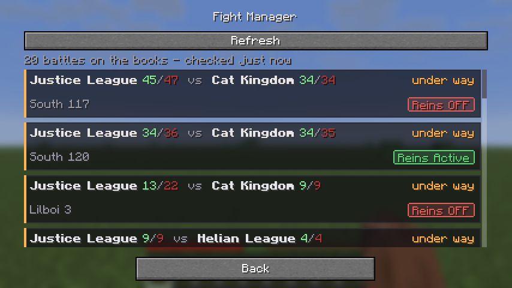

Every battle Loka has on its books — declared and waiting, or already under way:

- **Who is fighting whom**, town and alliance on each side
- **Where** — continent and territory number
- **How many are signed up** on each side
- Whether **reinforcements** can be called
- **When it can go off**

That last one is derived, because Loka publishes no start time: the field stays zero until a fight
actually begins. What decides it is the defending town's **vulnerability window**, so that is what is
shown — the eight hours it is attackable for. Not a countdown: the hour comes without a time zone, so
"starts in 3h" would be wrong for most people reading it where the window itself is exactly right.

Battles under way sort first and carry an orange spine.

## Town Logger

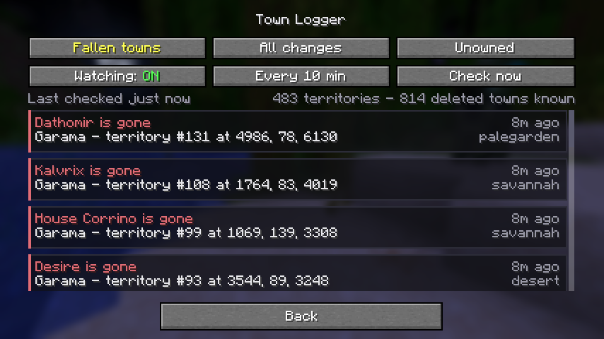

Which towns have fallen, and what they were holding.

The distinction the module exists for: a territory that moves from one living town to another was
**taken in a fight** and says nothing about either side. A territory that Loka still records to a
town it no longer has means that **town was deleted or collapsed** — and that is what the first tab
lists, with the continent, the territory number and the beacon coordinates.

That works because Loka does not clear a deleted town's claims: the territories keep pointing at an
id that no longer resolves. So the whole standing backlog appears on the **first sweep**, without
having to have been running when it happened. Naming the town takes the deleted-town roster, since a
deleted town 404s on a lookup by id.

Three tabs: **Fallen towns**, **All changes** (captures, releases and claims as they happen) and
**Unowned** (every territory nobody holds). The log is written to `config/betterloka/town-log.json`
and survives restarts, so the baseline is not lost between sessions.

### What it costs to leave running

A sweep is three requests — one per continent — and about 850 KB, and runs every **30 minutes** by
default, the first one 5 minutes after launch. The deleted-town roster is forty small requests and is
refreshed at most once an hour, since it only changes when a town dies. That is roughly **2.4 MB an
hour**, and none of it competes with a screen you are looking at — background requests yield their
place in the queue. The interval button offers 2, 5, 10, 30 and 60 minutes, **Check now** forces a
sweep, and the whole thing can be switched off.

## Installing

1. Install [Fabric Loader](https://fabricmc.net/use/installer) 0.19.0+ for Minecraft 1.21.11.
2. Drop [Fabric API](https://modrinth.com/mod/fabric-api) into `mods/`.
3. Drop `betterloka-<version>.jar` into `mods/`.

Then open **Options → Controls → Key Binds**, find the **BetterLoka** category, and bind
**Open BetterLoka menu** to whatever key you like. It defaults to `L`.

Settings live in `config/betterloka/config.json` and are written as you change them in the GUI.

## Where the data comes from

**EldritchBot** parses Loka's Conquest fight logs and publishes per-player career totals. It has one
JSON endpoint (`/api/player/<name>` — kills and deaths only, and case sensitive), so everything else
is read from the server-rendered player page, and each fight's breakdown from the fight page it
links to.

**Loka's own API** supplies rank, account age, town rosters, territory ownership, the deleted-town
roster and the battles running right now — the things EldritchBot does not track.

**Loka's ranked ladders** at `webapi.lokamc.com` are what the leaderboard page on the site reads, so
the mod reads them directly rather than scraping the page around them.

A full profile is about ten requests and lands in roughly a second. The card appears as soon as the
career totals arrive; the fight rows fill in behind it.

Several things are done deliberately in the HTTP layer, all measured against the live services:

- Requests are paced by a token bucket, one per host, and a 429 backs every thread off at once.
- The client speaks **HTTP/1.1 on purpose**. Over HTTP/2 the JDK client multiplexes every request
  onto one connection per host and parallel work serialises behind it — the same sweep measured 8x
  slower, with rate-limit backoff on top.
- **Background work yields.** A sweep or an index build hangs back before taking its permit, so a
  search never queues behind traffic nobody asked for.

## What it costs a connection

Three of the things the mod reads are large and barely change, and re-fetching them every session was
most of what it cost — enough that on a home connection the Player Finder and Town Finder could look
like they were not loading at all. They are cached to disk in `config/betterloka/`:

| Cached | Size | Kept for | Why that is safe |
| --- | --- | --- | --- |
| `towns.json` | 968 KB → 48 KB | 12 hours | Loka ships every town with its full member list; the mod uses a dozen fields, so only those are stored. |
| `fights.json` | ~110 KB per fight | 30 days | A finished fight's numbers never change again. |
| `arena-history.json` | ~1.8 MB | 24 hours | A finished season's final table never changes again. |

Measured end to end, opening the Player Finder and then the Town Finder:

| | Before | After (cold) | After (cached) |
| --- | --- | --- | --- |
| Town Finder roster | 6755 ms | 99 ms | **99 ms** |
| Player Finder, complete | 2750 ms | 2153 ms | **1894 ms** |
| Downloaded | ~4 MB | ~1.2 MB | **~0.2 MB** |

The territory sweep also went from every 10 minutes to **every 30**, with the first one 5 minutes
after launch rather than 1 — starting the game already saturates a connection, and a sweep on top of
that is exactly when somebody opens the first screen.

### What is not shown

**Charge success rate** is not available. EldritchBot publishes how many golems and lamps a player
has taken, but not how many they attempted, so a percentage cannot be computed without downloading
every fight that player has ever been in.

**Total currency on the server** is not available either — Loka's market endpoints cover listings,
not balances.

## Building

Requires JDK 21.

```bash
./gradlew build          # jar lands in build/libs/
```

## Testing

```bash
./gradlew test                            # offline: HTML/JSON parsing
./gradlew test -Pbetterloka.live=true     # also hits the live services end to end
```

The parsing tests run against fixtures shaped like the real markup; the live suite is what catches
those sites changing. It checks a real career, a real fight breakdown, the nameplate endpoint, the
not-found path, case-insensitive lookup, the market, translation in both directions, both ranked
ladders and the territory sweep — and asserts that a whole profile still costs only a handful of
requests.

Some of those live checks are load-bearing assumptions rather than parsing:

- the ranked history is only usable per season because a season's weekly snapshots are **cumulative**,
  so the test asserts a later week includes the earlier one;
- the Town Logger only works because Loka **leaves a deleted town's id on its territories**, so the
  test sweeps every continent and resolves each dangling holder against the deleted-town roster;
- the vulnerability window is only an hour of the day if it reads as one, so the test asserts it;
- the RIVI split rests on the map naming, so the test classifies a real player's recent fights and
  asserts no Conquest territory is ever filed as RIVI and no RIVI fight is a hundred players.

The offline suite covers the log's persistence too. Its baseline, its already-reported towns and its
alliance history are all written as records, and a serialiser that could not read them back would
look exactly like a logger that forgets everything on restart.

### Screenshots

The pictures in this README are taken by a real client, not mocked up. `BETTERLOKA_SHOTS=1` turns on
a driver that creates a flat world, walks the screens and saves each shot to `run/screenshots`:

```bash
BETTERLOKA_SHOTS=1 xvfb-run -a ./gradlew runClient
```

It is how the on-screen countdown is checked at all — a HUD element only renders in a loaded world,
so nothing about it can be verified from a title screen. Without the variable the driver is never
constructed.

## License

MIT. Not affiliated with or endorsed by Loka or EldritchBot.
