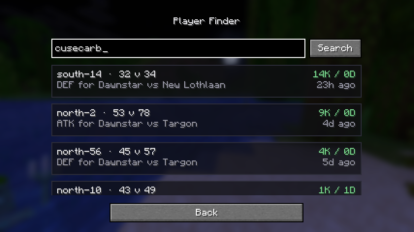

# BetterLoka

A client-side Fabric mod for **[Loka](https://lokamc.com)** (`play.lokamc.com`), Minecraft **1.21.11**.

BetterLoka adds an in-game menu, opened with a key you bind yourself, that pulls live data from
Loka's public API. It is entirely client-side: it never talks to the game server, sends nothing
about you anywhere, and works whether or not you are connected to Loka.

## Modules

| Module | Status |
| --- | --- |
| **Player Finder** | Working |
| Translator | Planned |
| Fight Manager | Planned |
| Loka Helper | Planned |

The three planned modules are listed in the menu but open a placeholder screen for now.

## Player Finder


Type a Loka player's name, hit Search, and you get:

- **Kills**, **deaths** and **K/D** across their whole Conquest record
- **Number of battles** they actually fought in
- Their **town** — level, continent, member count, whether it is recruiting
- **Who they currently fight for** — Loka lets players reinforce towns other than their own, so
  this is taken from their most recent battle, not from their membership
- **When they first appeared on Loka**
- Their **last 5 fights**, each as `territory · your side v enemy side · kills/deaths`, with the
  town they fought for, the enemy town, and how long ago it was



Battles that are running right now are folded in and marked `LIVE`.

Name lookup is case-insensitive even though Loka's endpoint is not — a casing miss falls back to
resolving the canonical name through Mojang and retrying by UUID.

## Installing

1. Install [Fabric Loader](https://fabricmc.net/use/installer) 0.19.0+ for Minecraft 1.21.11.
2. Drop [Fabric API](https://modrinth.com/mod/fabric-api) into `mods/`.
3. Drop `betterloka-<version>.jar` into `mods/`.

Then open **Options → Controls → Key Binds**, find the **BetterLoka** category, and bind
**Open BetterLoka menu** to whatever key you like. It defaults to `L`.

## How the data works

Loka's API exposes per-player kills and deaths *only* inside individual battle records, and it has
no "battles for player X" endpoint — the only way to answer that question is to hold the battle
history locally and look sideways through it. So on first run BetterLoka downloads the full history
(about 8,000 battles, ~410 requests, a minute and a half) and writes it to
`config/betterloka/battles.bin` as a gzipped binary index — roughly 3 MB, down from 65 MB of raw
JSON.

After that, every launch compares the battle count the server reports against the count already
stored and fetches only the pages covering the difference. A typical start-up sync is one or two
requests and finishes in under two seconds.

Requests are paced by a shared token bucket and the client speaks HTTP/1.1 on purpose — over
HTTP/2 the JDK client multiplexes everything onto one connection to `api.lokamc.com` and the sync
serialises behind it, turning a 10-second sweep into 80 seconds of rate-limit backoff.

The Player Finder does not wait for any of this. Identity and town resolve in two requests and
appear immediately; the combat card fills in when the history lands.

### What the API does not provide

Some things simply are not in Loka's public data, so BetterLoka does not show them rather than
guessing:

- **Assists** — battle records carry kills, deaths and damage, but no assists.
- **Nemesis** — kills are stored per player per battle, with no record of who killed whom, so
  "who killed you most this month" is not derivable.
- **Town join date** — town members carry only a `subowner` flag, with no joined-at timestamp.

"First seen" is derived from the creation timestamp embedded in the player's identity ObjectID,
which is when their first Loka profile was created.

## Building

Requires JDK 21.

```bash
./gradlew build          # jar lands in build/libs/
```

## Testing

```bash
./gradlew test                            # offline: parsing and cache round-trip
./gradlew test -Pbetterloka.live=true     # also hits api.lokamc.com end-to-end (~5 min)
```

The live suite syncs the real battle history, builds a real profile out of it, and checks that a
second run reuses the cache instead of resyncing.

Two dev helpers are also available:

```bash
# Measure how fast the live API will let us page, to re-tune the request rate
./gradlew test -Pbetterloka.diag=true -Pbetterloka.rate=5 --tests "*PageFetchDiagnosticTest"

# Pre-seed a dev client's cache so ./gradlew runClient starts with the history in place
./gradlew test -Pbetterloka.seed=run/config/betterloka/battles.bin --tests "*CacheSeedTest"
```

## License

MIT. Not affiliated with or endorsed by Loka.
